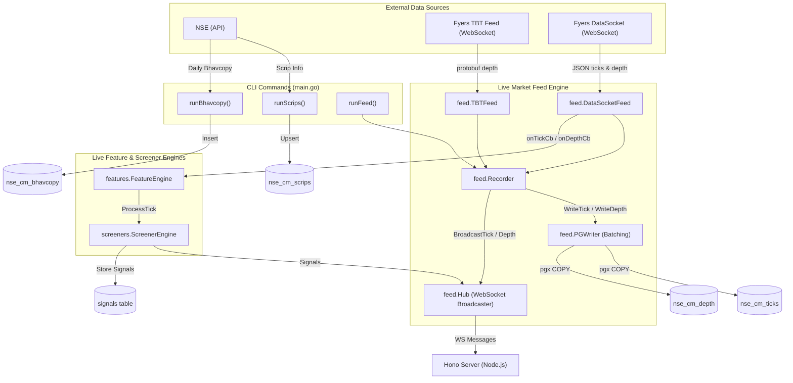

# Go Engine Data Flow

The Go Engine (`engine/`) connects to data brokers (such as Fyers via WebSocket feeds or NSE API for Bhavcopy and Scrip data) and pushes the data to PostgreSQL (`atdb`) and local WebSocket consumers.

Below is the high-level data flow diagram represented using Mermaid.js.

### Components Summary:

- **Sources:**
  - **NSE APIs**: Provide static Scrip and Bhavcopy (EOD) data.
  - **Fyers TBT & DataSocket Feeds**: Real-time websocket data for ticks and order book depths.

- **Pipeline Handlers:**
  - `feed.TBTFeed` consumes the raw protobuf feeds for tick-by-tick depth data.
  - `feed.DataSocketFeed` handles standard tick and partial depth JSON updates.
  - `feed.Recorder` manages these connections and acts as a central coordinator.

- **Storage & Processing:**
  - `feed.PGWriter` buffers the real-time structs (`DepthRow`, `TickRow`) and flushes them to PostgreSQL via `pgx.CopyFrom` to sustain high throughput.
  - **Feature & Screener Engines:** Callbacks are triggered on incoming data which recalculate live analytics and trigger strategy signals.
  - `feed.Hub` acts as an internal WebSockets broadcaster passing real-time tick, depth, and signal JSON to downstream UI/Server clients (e.g. Hono Server).
